# ERD Museum v2 — Entity-Relationship Model & Field Dictionary

> **Basis:** PDF-Entitäten (`Entities_for_Table.pdf`, `Relationales Modell (Tabellen).pdf`) + erweiterte Museumsmodell-Struktur  
> **Ziel:** Flyway-ready PostgreSQL schema  
> **Stack:** Spring Boot + PostgreSQL + MinIO  
> **Last updated:** 2026-05-29 (V3 documentation entities)

---

## 1. Konzeptuelles ERD

```mermaid
erDiagram
  MUSEUM_OBJECT ||--o{ CONDITION_REPORT : has
  MUSEUM_OBJECT ||--o{ RESTORATION : has
  MUSEUM_OBJECT ||--o{ INSURANCE : has
  MUSEUM_OBJECT ||--o{ PROVENANCE : has
  MUSEUM_OBJECT ||--o{ LOAN : has
  MUSEUM_OBJECT ||--o{ RESEARCH_REPORT : has
  MUSEUM_OBJECT ||--o{ ART_HISTORICAL_REPORT : has
  MUSEUM_OBJECT ||--o{ OBJECT_DOCUMENT : has
  MUSEUM_OBJECT ||--o{ OBJECT_PHOTO : has
  MUSEUM_OBJECT ||--o{ IDENTIFIER : has
  MUSEUM_OBJECT ||--o{ OBJECT_PERSON : has
  MUSEUM_OBJECT }o--|| STORAGE_LOCATION : stored_in
  MUSEUM_OBJECT }o--o| CONTAINER : in_container
  MUSEUM_OBJECT }o--o{ EXHIBITION : via_exhibition_object
  MUSEUM_OBJECT }o--o{ CATEGORY : via_object_category
  MUSEUM_OBJECT }o--o{ MATERIAL : via_object_material

  PERSON ||--o{ OBJECT_PERSON : linked
  CONDITION_REPORT ||--o{ DAMAGE_ENTRY : contains
  DAMAGE_TYPE ||--o{ DAMAGE_ENTRY : classifies
  RESTORATION ||--o{ OBJECT_DOCUMENT : attached
  RESEARCH_REPORT ||--o{ OBJECT_DOCUMENT : attached
  ART_HISTORICAL_REPORT ||--o{ OBJECT_DOCUMENT : attached
  CONDITION_REPORT ||--o{ OBJECT_DOCUMENT : attached
  RESTORATION }o--o| CONDITION_REPORT : before_after
  ART_HISTORICAL_REPORT }o--o| ART_HISTORICAL_REPORT : supersedes

  EXHIBITION ||--o{ EXHIBITION_OBJECT : contains
  EXHIBITION }o--o{ TRANSPORT_TYPE : via_exhibition_transport

  STORAGE_LOCATION ||--o{ CLIMATE_DATA : monitored
  STORAGE_LOCATION ||--o{ CONTAINER : holds
  STORAGE_LOCATION ||--o{ MUSEUM_OBJECT : current_location

  ROLE ||--o{ USER_ACCOUNT : assigns
  USER_ACCOUNT ||--o{ AUDIT_LOG : performs

  MUSEUM_OBJECT {
    uuid id PK
    string system_number UK
    string inventar_number
    string part_number
    string title
    date object_date
  }

  PROVENANCE {
    uuid id PK
    uuid object_id FK
    string owner_name
    date from_date
    date to_date
  }

  INSURANCE {
    uuid id PK
    uuid object_id FK
    string insurer
    decimal insured_value
  }

  RESTORATION {
    uuid id PK
    uuid object_id FK
    string status
    string treatment_plan
    date start_date
  }

  RESEARCH_REPORT {
    uuid id PK
    uuid object_id FK
    string research_type
    text results
  }

  ART_HISTORICAL_REPORT {
    uuid id PK
    uuid object_id FK
    string attribution
    string attribution_certainty
  }

  OBJECT_DOCUMENT {
    uuid id PK
    uuid object_id FK
    string linked_entity_type
    uuid linked_entity_id
    text file_uri
  }

  LOAN {
    uuid id PK
    uuid object_id FK
    string institution
    string loan_type
  }

  IDENTIFIER {
    uuid id PK
    uuid object_id FK
    string identifier_type
    string code UK
  }
```




---

## 2. Objekt-Hierarchie (empfohlene Hauptstruktur)

```text
MuseumObject
├── parent_object_id (n:1, optional — Serie/Sammelobjekt)
├── ConditionReport (1:n) ── DamageEntry (1:n)
├── Restoration (1:n) ── Restaurierungsdokumentation + ObjectDocument
├── ResearchReport (1:n) ── Forschungsdokumentation + ObjectDocument
├── ArtHistoricalReport (1:n) ── Kunsthistorische Information + ObjectDocument
├── Insurance (1:n)
├── Provenance (1:n)
├── Loan (1:n)
├── ObjectPhoto (1:n)
├── Identifier (1:n)
├── ObjectPerson (n:m) ── Person
├── ObjectCategory (n:m) ── Category
├── ObjectMaterial (n:m) ── Material / Submaterial
├── ExhibitionObject (n:m) ── Exhibition
├── ObjectPackaging (n:m) ── PackagingType
├── Container (n:1, optional)
└── StorageLocation (n:1, current)

StorageLocation
├── ClimateData (1:n)
├── Container (1:n)
└── MuseumObject (1:n)

UserAccount (n:1) ── Role
```

### Dokumentationsfluss (Restaurierung · Forschung · Kunsthistorik)

```text
ConditionReport (Zustand vorher)
    ↓
Restoration (Maßnahmen + treatment_plan + ObjectDocument/PDF)
    ↓
ConditionReport (Zustand nachher)

ResearchReport (XRF, Röntgen, Dendro…) ──→ stützt ──→ ArtHistoricalReport (Datierung, Attribution)

ArtHistoricalReport ←── verweist auf ── Provenance, Person, Exhibition
Alle Berichte ──→ ObjectDocument (PDF, Gutachten, Laborberichte)
Fotos ──→ ObjectPhoto (before_treatment, after_treatment, …) [V5]
```

---

## 3. Kardinalitäten — Übersicht


| Beziehung                     | Kardinalität | Join-Tabelle / FK                       |
| ----------------------------- | ------------ | --------------------------------------- |
| Object → ConditionReport      | **1 : n**    | `condition_report.object_id`            |
| Object → Restoration          | **1 : n**    | `restoration.object_id`                 |
| Object → ResearchReport       | **1 : n**    | `research_report.object_id`             |
| Object → ArtHistoricalReport  | **1 : n**    | `art_historical_report.object_id`       |
| Object → ObjectDocument       | **1 : n**    | `object_document.object_id`             |
| Restoration → ConditionReport | **n : 1** ×2 | `condition_report_before/after_id`      |
| ArtHistoricalReport → self    | **n : 1**    | `supersedes_report_id` (Versionierung)  |
| Report → ObjectDocument       | **1 : n**    | polymorphisch `linked_entity_`*         |
| Object → Insurance            | **1 : n**    | `insurance.object_id`                   |
| Object → Provenance           | **1 : n**    | `provenance.object_id`                  |
| Object → Loan                 | **1 : n**    | `loan.object_id`                        |
| Object → ObjectPhoto          | **1 : n**    | `object_photo.object_id`                |
| Object → Identifier           | **1 : n**    | `identifier.object_id`                  |
| Object → Person               | **n : m**    | `object_person`                         |
| Object → Category             | **n : m**    | `object_category`                       |
| Object → Material             | **n : m**    | `object_material`                       |
| Object → Exhibition           | **n : m**    | `exhibition_object`                     |
| Object → PackagingType        | **n : m**    | `object_packaging`                      |
| Object → Container            | **n : 1**    | `museum_object.container_id` (optional) |
| Object → StorageLocation      | **n : 1**    | `museum_object.storage_location_id`     |
| Object → Object (Serie/Teile) | **n : 1**    | `museum_object.parent_object_id`        |
| ConditionReport → DamageEntry | **1 : n**    | `damage_entry.condition_report_id`      |
| DamageType → DamageEntry      | **1 : n**    | `damage_entry.damage_type_id`           |
| Exhibition → TransportType    | **n : m**    | `exhibition_transport`                  |
| StorageLocation → ClimateData | **1 : n**    | `climate_data.storage_location_id`      |
| StorageLocation → Container   | **1 : n**    | `container.storage_location_id`         |
| Role → UserAccount            | **1 : n**    | `user_account.role_id`                  |
| UserAccount → ConditionReport | **1 : n**    | `condition_report.created_by_user_id`   |
| UserAccount → AuditLog        | **1 : n**    | `audit_log.user_id`                     |


---

## 4. Technische Sync-Felder (alle Business-Tabellen)

Jede synchronisierbare Tabelle enthält:


| Feld                | Typ                            | Beschreibung                    |
| ------------------- | ------------------------------ | ------------------------------- |
| `id`                | UUID                           | Primary Key                     |
| `created_at`        | TIMESTAMPTZ NOT NULL           | Server-Erstellungszeit          |
| `updated_at`        | TIMESTAMPTZ NOT NULL           | Server-Letztes-Update           |
| `version`           | BIGINT NOT NULL DEFAULT 1      | Optimistic locking + Sync       |
| `is_deleted`        | BOOLEAN NOT NULL DEFAULT FALSE | Soft delete                     |
| `created_by`        | UUID NULL                      | FK → `user_account.id`          |
| `updated_by`        | UUID NULL                      | FK → `user_account.id`          |
| `client_updated_at` | TIMESTAMPTZ NULL               | Client-Zeitstempel (Sync)       |
| `last_synced_at`    | TIMESTAMPTZ NULL               | Letzter erfolgreicher Sync      |
| `sync_status`       | VARCHAR(20) NULL               | `pending`, `synced`, `conflict` |


**Ausnahmen (kein Sync):** `role`, reine Lookup-Tabellen ohne Client-Schreibzugriff können vereinfacht werden (nur `id`, `created_at`).

---

## 5. Entitäten & Felddictionary

### 5.1 `museum_object`

Kernentität — Inventarobjekt.

#### Identifikationsstrategie (wichtig)

In Museen gilt:

- **Mehrere Objekte können dieselbe Inventarnummer haben** (Serien, Teile, historische Dubletten, unvollständige Erfassung).
- **Manche Objekte haben gar keine Inventarnummer** (Neuzugang, in Bearbeitung, digitale Objekte).

**Lösung: zwei Ebenen der Identifikation**


| Ebene                         | Feld               | Regel                                        | Zweck                                                     |
| ----------------------------- | ------------------ | -------------------------------------------- | --------------------------------------------------------- |
| **System-ID (Pflicht)**       | `id` (UUID)        | Immer eindeutig, automatisch                 | Technische Wahrheit: FKs, Sync, API, Audit                |
| **Museumsnummer (Optional)**  | `system_number`    | Eindeutig, wenn gesetzt; vom System vergeben | Menschenlesbare interne Referenz (z.B. `MUS-2026-000042`) |
| **Inventarnummer (Optional)** | `inventar_number`  | **Nicht eindeutig**, NULL erlaubt            | Katalog-/Bestandsnummer aus Museumstradition              |
| **Teilenummer (Optional)**    | `part_number`      | NULL erlaubt                                 | Unterscheidet Teile einer Serie (`.1`, `.2`, `Teil A`)    |
| **Hierarchie (Optional)**     | `parent_object_id` | FK → `museum_object.id`                      | Serie/Sammelobjekt → Einzelteile                          |


```text
System referenziert IMMER:     museum_object.id  (UUID)
Mitarbeiter suchen oft nach:   inventar_number + part_number + title
Barcode/RFID (physisch):       identifier (typ=barcode|rfid) — pro Tag eindeutig
```

**Beispiele aus der Praxis**


| Situation                          | id     | inventar_number | part_number | parent_object_id          |
| ---------------------------------- | ------ | --------------- | ----------- | ------------------------- |
| Einzelobjekt mit Nummer            | uuid-1 | SKU-00077       | NULL        | NULL                      |
| Objekt ohne Nummer (Neuzugang)     | uuid-2 | NULL            | NULL        | NULL                      |
| Serie „GRA-01273“ (10 Teile)       | uuid-3 | GRA-01273       | NULL        | NULL (Elternobjekt Serie) |
| Teil 1 der Serie                   | uuid-4 | GRA-01273       | .1          | uuid-3                    |
| Teil 2 der Serie                   | uuid-5 | GRA-01273       | .2          | uuid-3                    |
| Historische Dublette (gleiche Nr.) | uuid-6 | SKU-00077       | NULL        | NULL                      |


**Anzeige in der UI (empfohlen):**

```text
[MUS-2026-000042]  GRA-01273.1 — „Serie 10, Blatt 1“
 ^system_number      ^inventar+teil   ^title
```

**API:** immer `GET /api/v1/objects/{id}` mit UUID — nie mit Inventarnummer als Primary Key.


| Feld                    | Typ           | Pflicht  | Beschreibung                                                                    |
| ----------------------- | ------------- | -------- | ------------------------------------------------------------------------------- |
| `id`                    | UUID          | PK       | **Eindeutige System-ID** — technische Wahrheit für alle Beziehungen             |
| `system_number`         | VARCHAR(50)   | UK, NULL | Vom System vergebene Museumsnummer (z.B. MUS-2026-000042); optional bis Vergabe |
| `inventar_number`       | VARCHAR(100)  | NULL     | Katalog-Inventarnummer; **darf dupliziert und leer sein**                       |
| `part_number`           | VARCHAR(50)   | NULL     | Teilenummer/Suffix (`.1`, `Teil B`) bei Serien und Mehrteilerobjekten           |
| `parent_object_id`      | UUID          | FK NULL  | FK → `museum_object.id` (Elternobjekt bei Serien/Sammeln)                       |
| `title`                 | VARCHAR(255)  | NOT NULL | Titel des Objekts                                                               |
| `object_date_text`      | VARCHAR(100)  | NULL     | z.B. "1862", "18. Jh."                                                          |
| `object_date_from`      | DATE          | NULL     | Präzises Startdatum (optional)                                                  |
| `object_date_to`        | DATE          | NULL     | Präzises Enddatum (optional)                                                    |
| `technique`             | VARCHAR(255)  | NULL     | Technik (z.B. Öl auf Leinwand)                                                  |
| `height_cm`             | DECIMAL(10,2) | NULL     | Höhe in cm                                                                      |
| `width_cm`              | DECIMAL(10,2) | NULL     | Breite in cm                                                                    |
| `depth_cm`              | DECIMAL(10,2) | NULL     | Tiefe in cm                                                                     |
| `owner_organization_id` | UUID          | FK NULL  | FK → `organization.id`                                                          |
| `storage_location_id`   | UUID          | FK NULL  | FK → `storage_location.id` (aktueller Standort)                                 |
| `container_id`          | UUID          | FK NULL  | FK → `container.id`                                                             |
| `can_be_exhibited`      | BOOLEAN       | NULL     | Ausstellbar?                                                                    |
| `can_be_transported`    | BOOLEAN       | NULL     | Transportierbar?                                                                |
| `notes`                 | TEXT          | NULL     | Allgemeine Bemerkungen                                                          |
| `metadata`              | JSONB         | NULL     | Flexible Metadaten (IIIF, OCR, Import)                                          |
| + sync fields           |               |          | siehe §4                                                                        |


**Entfernt gegenüber flachem Modell:**


| Alt (flach)            | Neu (Beziehung)                          |
| ---------------------- | ---------------------------------------- |
| `author` (String)      | `object_person` → `person` (role=author) |
| `condition` (String)   | `condition_report` (Historie)            |
| `photo` (Link)         | `object_photo`                           |
| `standort` (String)    | `storage_location_id`                    |
| `barcode` / `rfid`     | `identifier`                             |
| `insurance` (ein Feld) | `insurance` (1:n Historie)               |


**Inventarnummer:** kein UNIQUE-Constraint — siehe Identifikationsstrategie oben.

---

### 5.2 `person`

Personen: Künstler, Restauratoren, Sammler, Kuratoren.


| Feld           | Typ          | Pflicht  | Beschreibung      |
| -------------- | ------------ | -------- | ----------------- |
| `id`           | UUID         | PK       |                   |
| `full_name`    | VARCHAR(255) | NOT NULL | Name              |
| `birth_year`   | INTEGER      | NULL     | Geburtsjahr       |
| `death_year`   | INTEGER      | NULL     | Sterbejahr        |
| `biography`    | TEXT         | NULL     | Kurzbiografie     |
| `external_uri` | VARCHAR(500) | NULL     | GND/Wikidata-Link |
| + sync fields  |              |          |                   |


**Beziehung:** `object_person` (n:m mit Rolle)

---

### 5.3 `object_person`

Verknüpfung Objekt ↔ Person mit Rolle.


| Feld          | Typ         | Pflicht       | Beschreibung                              |
| ------------- | ----------- | ------------- | ----------------------------------------- |
| `id`          | UUID        | PK            |                                           |
| `object_id`   | UUID        | FK NOT NULL   |                                           |
| `person_id`   | UUID        | FK NOT NULL   |                                           |
| `role`        | VARCHAR(50) | NOT NULL      | `author`, `owner`, `donor`, `conservator` |
| `is_primary`  | BOOLEAN     | DEFAULT FALSE | Hauptautor/Hauptbesitzer                  |
| `notes`       | TEXT        | NULL          |                                           |
| + sync fields |             |               |                                           |


**Kardinalität:** Object **n : m** Person  
**UNIQUE:** (`object_id`, `person_id`, `role`)

---

### 5.4 `organization`

Institutionen: Museen, Leihgeber, Versicherer.


| Feld           | Typ          | Pflicht  | Beschreibung     |
| -------------- | ------------ | -------- | ---------------- |
| `id`           | UUID         | PK       |                  |
| `name`         | VARCHAR(255) | NOT NULL | Institutionsname |
| `city`         | VARCHAR(120) | NULL     |                  |
| `country`      | VARCHAR(120) | NULL     |                  |
| `external_uri` | VARCHAR(500) | NULL     |                  |
| + sync fields  |              |          |                  |


---

### 5.5 `provenance`

Provenienz — Herkunft und Besitzgeschichte.


| Feld                    | Typ          | Pflicht     | Beschreibung                                        |
| ----------------------- | ------------ | ----------- | --------------------------------------------------- |
| `id`                    | UUID         | PK          |                                                     |
| `object_id`             | UUID         | FK NOT NULL |                                                     |
| `owner_name`            | VARCHAR(255) | NULL        | Besitzer (Text oder FK optional)                    |
| `owner_person_id`       | UUID         | FK NULL     | FK → `person.id`                                    |
| `owner_organization_id` | UUID         | FK NULL     | FK → `organization.id`                              |
| `from_date`             | DATE         | NULL        | Von-Datum                                           |
| `to_date`               | DATE         | NULL        | Bis-Datum                                           |
| `origin`                | VARCHAR(500) | NULL        | Herkunft (Ort, Auktion, Erwerb)                     |
| `acquisition_type`      | VARCHAR(50)  | NULL        | `purchase`, `gift`, `loan`, `excavation`, `unknown` |
| `notes`                 | TEXT         | NULL        | Bemerkung                                           |
| + sync fields           |              |             |                                                     |


**Kardinalität:** Object **1 : n** Provenance

---

### 5.6 `insurance`

Versicherungshistorie (mehrere Policen über die Zeit).


| Feld                 | Typ           | Pflicht     | Beschreibung          |
| -------------------- | ------------- | ----------- | --------------------- |
| `id`                 | UUID          | PK          |                       |
| `object_id`          | UUID          | FK NOT NULL |                       |
| `insurer`            | VARCHAR(255)  | NULL        | Versicherer           |
| `insured_value`      | DECIMAL(14,2) | NULL        | Versicherungswert     |
| `currency`           | CHAR(3)       | NULL        | z.B. EUR, CHF         |
| `contract_number`    | VARCHAR(100)  | NULL        | Vertragsnummer        |
| `start_date`         | DATE          | NULL        | Startdatum            |
| `end_date`           | DATE          | NULL        | Enddatum              |
| `special_conditions` | TEXT          | NULL        | Besondere Bedingungen |
| + sync fields        |               |             |                       |


**Kardinalität:** Object **1 : n** Insurance

---

### 5.7 `restoration` (Restaurierungsdokumentation)

Restaurierungsmaßnahmen **und** formale Restaurierungsdokumentation.


| Feld                         | Typ           | Pflicht     | Beschreibung                                    |
| ---------------------------- | ------------- | ----------- | ----------------------------------------------- |
| `id`                         | UUID          | PK          |                                                 |
| `object_id`                  | UUID          | FK NOT NULL |                                                 |
| `restaurator_user_id`        | UUID          | FK NULL     | FK → `user_account.id` (V6)                     |
| `restaurator_person_id`      | UUID          | FK NULL     | FK → `person.id`                                |
| `start_date`                 | DATE          | NULL        | Startdatum                                      |
| `end_date`                   | DATE          | NULL        | Enddatum                                        |
| `status`                     | VARCHAR(30)   | NOT NULL    | `draft`, `in_progress`, `completed`, `approved` |
| `measures`                   | TEXT          | NULL        | Durchgeführte Maßnahmen                         |
| `treatment_plan`             | TEXT          | NULL        | Restaurierungsplan                              |
| `materials_used`             | TEXT          | NULL        | Verwendete Materialien                          |
| `reversibility_notes`        | TEXT          | NULL        | Reversibilität der Eingriffe                    |
| `ethical_assessment`         | TEXT          | NULL        | Ethische Bewertung                              |
| `report_summary`             | TEXT          | NULL        | Kurzresümee für Katalog                         |
| `cost`                       | DECIMAL(12,2) | NULL        | Kosten                                          |
| `currency`                   | CHAR(3)       | NULL        |                                                 |
| `condition_report_before_id` | UUID          | FK NULL     | Zustand vor Restaurierung                       |
| `condition_report_after_id`  | UUID          | FK NULL     | Zustand nach Restaurierung                      |
| `notes`                      | TEXT          | NULL        |                                                 |
| `metadata`                   | JSONB         | NULL        | Erweiterbare Felder                             |
| + sync fields                |               |             |                                                 |


**Kardinalität:** Object **1 : n** Restoration  
**Anhänge:** `object_document` (PDF-Berichte), `object_photo` (`before_treatment`, `during_treatment`, `after_treatment` — V5)

---

### 5.8 `loan`

Leihverkehr (getrennt von Transport).


| Feld                          | Typ          | Pflicht     | Beschreibung                                  |
| ----------------------------- | ------------ | ----------- | --------------------------------------------- |
| `id`                          | UUID         | PK          |                                               |
| `object_id`                   | UUID         | FK NOT NULL |                                               |
| `institution`                 | VARCHAR(255) | NOT NULL    | Leihinstitution                               |
| `institution_organization_id` | UUID         | FK NULL     | FK → `organization.id`                        |
| `loan_type`                   | VARCHAR(20)  | NOT NULL    | `incoming`, `outgoing`                        |
| `start_date`                  | DATE         | NULL        | Startdatum                                    |
| `end_date`                    | DATE         | NULL        | Enddatum                                      |
| `insurance_notes`             | TEXT         | NULL        | Versicherung beim Leihverkehr                 |
| `condition_before`            | VARCHAR(20)  | NULL        | Zustand vorher (`good`, `medium`, `critical`) |
| `condition_after`             | VARCHAR(20)  | NULL        | Zustand nachher                               |
| `condition_report_before_id`  | UUID         | FK NULL     | FK → `condition_report.id`                    |
| `condition_report_after_id`   | UUID         | FK NULL     | FK → `condition_report.id`                    |
| `notes`                       | TEXT         | NULL        |                                               |
| + sync fields                 |              |             |                                               |


**Kardinalität:** Object **1 : n** Loan

---

### 5.9 `condition_report`

Zustandshistorie — **nicht** ein einzelnes Feld am Objekt.


| Feld                    | Typ         | Pflicht     | Beschreibung                           |
| ----------------------- | ----------- | ----------- | -------------------------------------- |
| `id`                    | UUID        | PK          |                                        |
| `object_id`             | UUID        | FK NOT NULL |                                        |
| `report_date`           | DATE        | NOT NULL    | Datum                                  |
| `created_by_user_id`    | UUID        | FK NULL     | Bearbeiter (User)                      |
| `conservator_person_id` | UUID        | FK NULL     | Restaurator (Person)                   |
| `condition_code`        | VARCHAR(20) | NOT NULL    | `good`, `medium`, `critical`           |
| `damage_severity`       | VARCHAR(20) | NULL        | Schadensgrad (`low`, `medium`, `high`) |
| `summary`               | TEXT        | NULL        | Zusammenfassung                        |
| `recommendations`       | TEXT        | NULL        | Empfehlungen                           |
| `can_be_exhibited`      | BOOLEAN     | NULL        | Ausstellbar laut diesem Report         |
| `can_be_transported`    | BOOLEAN     | NULL        | Transportierbar laut diesem Report     |
| + sync fields           |             |             |                                        |


**Kardinalität:** Object **1 : n** ConditionReport  
**Aktueller Zustand:** abgeleitet aus dem neuesten `condition_report` (View oder computed field).

---

### 5.10 `damage_type` (Lookup)


| Feld          | Typ          | Pflicht      | Beschreibung                                   |
| ------------- | ------------ | ------------ | ---------------------------------------------- |
| `id`          | UUID         | PK           |                                                |
| `name`        | VARCHAR(100) | UK NOT NULL  | crack, split, deformation, colour_changes, ... |
| `description` | TEXT         | NULL         |                                                |
| `is_system`   | BOOLEAN      | DEFAULT TRUE | System vs. benutzerdefiniert                   |
| + sync fields |              |              |                                                |


---

### 5.11 `damage_entry`


| Feld                  | Typ          | Pflicht     | Beschreibung             |
| --------------------- | ------------ | ----------- | ------------------------ |
| `id`                  | UUID         | PK          |                          |
| `condition_report_id` | UUID         | FK NOT NULL |                          |
| `damage_type_id`      | UUID         | FK NOT NULL |                          |
| `severity`            | VARCHAR(20)  | NULL        | `low`, `medium`, `high`  |
| `location_text`       | VARCHAR(255) | NULL        | front, back, detail area |
| `mapping_photo_id`    | UUID         | FK NULL     | FK → `object_photo.id`   |
| `notes`               | TEXT         | NULL        |                          |
| + sync fields         |              |             |                          |


**Kardinalität:** ConditionReport **1 : n** DamageEntry

---

### 5.11a `research_report` (Forschungsdokumentation)

Wissenschaftlich-technische Untersuchungen: XRF, IR, Röntgen, Dendrochronologie, etc.


| Feld                   | Typ          | Pflicht     | Beschreibung                                                                                       |
| ---------------------- | ------------ | ----------- | -------------------------------------------------------------------------------------------------- |
| `id`                   | UUID         | PK          |                                                                                                    |
| `object_id`            | UUID         | FK NOT NULL |                                                                                                    |
| `report_date`          | DATE         | NOT NULL    | Datum                                                                                              |
| `research_type`        | VARCHAR(50)  | NOT NULL    | `xrf`, `ir`, `uv`, `xray`, `dendrochronology`, `radiocarbon`, `petrography`, `microscopy`, `other` |
| `title`                | VARCHAR(255) | NULL        | Titel des Berichts                                                                                 |
| `institution`          | VARCHAR(255) | NULL        | Institution                                                                                        |
| `lab_name`             | VARCHAR(255) | NULL        | Labor                                                                                              |
| `researcher_person_id` | UUID         | FK NULL     | FK → `person.id`                                                                                   |
| `researcher_user_id`   | UUID         | FK NULL     | FK → `user_account.id`                                                                             |
| `methodology`          | TEXT         | NULL        | Methodik                                                                                           |
| `sample_description`   | TEXT         | NULL        | Probenbeschreibung                                                                                 |
| `results`              | TEXT         | NULL        | Ergebnisse                                                                                         |
| `conclusions`          | TEXT         | NULL        | Schlussfolgerungen                                                                                 |
| `status`               | VARCHAR(20)  | NOT NULL    | `draft`, `in_review`, `final`                                                                      |
| `metadata`             | JSONB        | NULL        | Rohdaten, Tabellen, Import                                                                         |
| + sync fields          |              |             |                                                                                                    |


**Kardinalität:** Object **1 : n** ResearchReport  
**Anhänge:** `object_document` (`lab_result`, `report_pdf`)

---

### 5.11b `art_historical_report` (Kunsthistorische Information)

Kunsthistorische Sachinformation / Expertise mit Versionshistorie.


| Feld                         | Typ          | Pflicht     | Beschreibung                                   |
| ---------------------------- | ------------ | ----------- | ---------------------------------------------- |
| `id`                         | UUID         | PK          |                                                |
| `object_id`                  | UUID         | FK NOT NULL |                                                |
| `report_date`                | DATE         | NOT NULL    | Erstellungsdatum                               |
| `title`                      | VARCHAR(255) | NULL        | Titel                                          |
| `author_person_id`           | UUID         | FK NULL     | Verfasser (Person)                             |
| `author_user_id`             | UUID         | FK NULL     | Verfasser (User)                               |
| `attribution`                | VARCHAR(255) | NULL        | Künstlerzuweisung                              |
| `attribution_certainty`      | VARCHAR(20)  | NULL        | `certain`, `probable`, `doubtful`, `unknown`   |
| `dating_text`                | VARCHAR(255) | NULL        | Datierung (Freitext)                           |
| `dating_from` / `dating_to`  | DATE         | NULL        | Präziser Zeitraum                              |
| `style_period`               | VARCHAR(255) | NULL        | Stil, Schule, Epoche                           |
| `subject_iconography`        | TEXT         | NULL        | Ikonographie, Sujet                            |
| `technique_analysis`         | TEXT         | NULL        | Technische Analyse                             |
| `historical_context`         | TEXT         | NULL        | Historischer Kontext                           |
| `bibliography`               | TEXT         | NULL        | Literatur                                      |
| `exhibition_history_summary` | TEXT         | NULL        | Ausstellungshistorie (Kurz)                    |
| `status`                     | VARCHAR(20)  | NOT NULL    | `draft`, `in_review`, `approved`, `superseded` |
| `version_number`             | INTEGER      | NOT NULL    | Versionsnummer                                 |
| `supersedes_report_id`       | UUID         | FK NULL     | Vorherige Version                              |
| `metadata`                   | JSONB        | NULL        |                                                |
| + sync fields                |              |             |                                                |


**Kardinalität:** Object **1 : n** ArtHistoricalReport  
**Versionierung:** neue Attribution/Datierung → neuer Report mit `supersedes_report_id`, alter Report `status=superseded`

---

### 5.11c `object_document`

Dateianhänge (PDF, Scans, Gutachten) — polymorphisch an Berichte gebunden.


| Feld                 | Typ          | Pflicht     | Beschreibung                                                                                        |
| -------------------- | ------------ | ----------- | --------------------------------------------------------------------------------------------------- |
| `id`                 | UUID         | PK          |                                                                                                     |
| `object_id`          | UUID         | FK NOT NULL |                                                                                                     |
| `linked_entity_type` | VARCHAR(50)  | NOT NULL    | `condition_report`, `restoration`, `research_report`, `art_historical_report`, `loan`, `provenance` |
| `linked_entity_id`   | UUID         | NOT NULL    | ID des verknüpften Berichts                                                                         |
| `document_kind`      | VARCHAR(50)  | NOT NULL    | `report_pdf`, `expert_opinion`, `lab_result`, `treatment_plan`, `scan`, `other`                     |
| `title`              | VARCHAR(255) | NULL        |                                                                                                     |
| `file_uri`           | TEXT         | NOT NULL    | MinIO/S3 URI                                                                                        |
| `mime_type`          | VARCHAR(100) | NULL        |                                                                                                     |
| `file_size_bytes`    | BIGINT       | NULL        |                                                                                                     |
| `checksum_sha256`    | CHAR(64)     | NULL        |                                                                                                     |
| `uploaded_at`        | TIMESTAMPTZ  | NOT NULL    |                                                                                                     |
| + sync fields        |              |             |                                                                                                     |


**Kardinalität:** Beliebiger Bericht **1 : n** ObjectDocument

---

### 5.12 `exhibition`


| Feld                | Typ          | Pflicht  | Beschreibung                     |
| ------------------- | ------------ | -------- | -------------------------------- |
| `id`                | UUID         | PK       |                                  |
| `title`             | VARCHAR(255) | NOT NULL | Titel                            |
| `city`              | VARCHAR(120) | NULL     | Ort                              |
| `country`           | VARCHAR(120) | NULL     | Land                             |
| `venue`             | VARCHAR(255) | NULL     | Ausstellungsort (Museum/Galerie) |
| `start_date`        | DATE         | NULL     | Startdatum                       |
| `end_date`          | DATE         | NULL     | Enddatum                         |
| `curator_person_id` | UUID         | FK NULL  | FK → `person.id`                 |
| `notes`             | TEXT         | NULL     |                                  |
| + sync fields       |              |          |                                  |


---

### 5.13 `exhibition_object`


| Feld            | Typ     | Pflicht     | Beschreibung                   |
| --------------- | ------- | ----------- | ------------------------------ |
| `id`            | UUID    | PK          |                                |
| `exhibition_id` | UUID    | FK NOT NULL |                                |
| `object_id`     | UUID    | FK NOT NULL |                                |
| `display_note`  | TEXT    | NULL        | Hinweis zur Präsentation       |
| `sort_order`    | INTEGER | NULL        | Reihenfolge in der Ausstellung |
| + sync fields   |         |             |                                |


**Kardinalität:** Exhibition **n : m** Object  
**UNIQUE:** (`exhibition_id`, `object_id`)

---

### 5.14 `category` + `object_category`

**category** (Lookup):


| Feld          | Typ             | Beschreibung                               |
| ------------- | --------------- | ------------------------------------------ |
| `id`          | UUID            | PK                                         |
| `name`        | VARCHAR(100) UK | painting, sculpture, textile, graphic, ... |
| `description` | TEXT            |                                            |


**object_category** (M:N):


| Feld          | Typ     | Beschreibung   |
| ------------- | ------- | -------------- |
| `object_id`   | UUID FK |                |
| `category_id` | UUID FK |                |
| `is_primary`  | BOOLEAN | Hauptkategorie |


**Kardinalität:** Object **n : m** Category

---

### 5.15 `material`, `submaterial`, `object_material`

**material** (Lookup):


| Feld   | Typ             | Beschreibung                       |
| ------ | --------------- | ---------------------------------- |
| `id`   | UUID            | PK                                 |
| `name` | VARCHAR(100) UK | Wood, Textile, Stone, Ceramic, ... |


**submaterial** (Lookup):


| Feld          | Typ          | Beschreibung                     |
| ------------- | ------------ | -------------------------------- |
| `id`          | UUID         | PK                               |
| `material_id` | UUID FK      |                                  |
| `name`        | VARCHAR(100) | Pine, Linen, Limestone, Oil, ... |


**object_material** (M:N):


| Feld             | Typ          | Beschreibung |
| ---------------- | ------------ | ------------ |
| `object_id`      | UUID FK      |              |
| `material_id`    | UUID FK      |              |
| `submaterial_id` | UUID FK NULL |              |
| `is_primary`     | BOOLEAN      |              |
| `notes`          | TEXT         |              |


**Kardinalität:** Object **n : m** Material (Submaterial optional)

---

### 5.16 `object_photo`


| Feld              | Typ          | Pflicht     | Beschreibung                                     |
| ----------------- | ------------ | ----------- | ------------------------------------------------ |
| `id`              | UUID         | PK          |                                                  |
| `object_id`       | UUID         | FK NOT NULL |                                                  |
| `photo_kind`      | VARCHAR(30)  | NOT NULL    | `front`, `back`, `detail`, `damage_map`, `other` |
| `file_uri`        | TEXT         | NOT NULL    | MinIO/S3 URI                                     |
| `thumbnail_uri`   | TEXT         | NULL        |                                                  |
| `checksum_sha256` | CHAR(64)     | NULL        | Integritätsprüfung                               |
| `mime_type`       | VARCHAR(100) | NULL        |                                                  |
| `file_size_bytes` | BIGINT       | NULL        |                                                  |
| `width_px`        | INTEGER      | NULL        |                                                  |
| `height_px`       | INTEGER      | NULL        |                                                  |
| `taken_at`        | TIMESTAMPTZ  | NULL        |                                                  |
| `caption`         | TEXT         | NULL        |                                                  |
| + sync fields     |              |             |                                                  |


**Kardinalität:** Object **1 : n** ObjectPhoto

---

### 5.17 `identifier`

Barcode, RFID, NFC, Inventarnummern — flexibler als feste Object-Felder.


| Feld              | Typ          | Pflicht       | Beschreibung                                                        |
| ----------------- | ------------ | ------------- | ------------------------------------------------------------------- |
| `id`              | UUID         | PK            |                                                                     |
| `object_id`       | UUID         | FK NOT NULL   |                                                                     |
| `identifier_type` | VARCHAR(30)  | NOT NULL      | `barcode`, `rfid`, `nfc`, `qr`, `inventar`, `provisional`, `legacy` |
| `code`            | VARCHAR(255) | NOT NULL      | Der eigentliche Code                                                |
| `is_primary`      | BOOLEAN      | DEFAULT FALSE | Primärer Identifier dieses Typs für das Objekt                      |
| `valid_from`      | DATE         | NULL          | Gültig ab (bei Nummernwechsel)                                      |
| `valid_to`        | DATE         | NULL          | Gültig bis                                                          |
| `notes`           | TEXT         | NULL          |                                                                     |
| + sync fields     |              |               |                                                                     |


**Kardinalität:** Object **1 : n** Identifier

**Eindeutigkeitsregeln (typabhängig):**


| identifier_type                     | Global eindeutig?                                      | Begründung                          |
| ----------------------------------- | ------------------------------------------------------ | ----------------------------------- |
| `barcode`, `rfid`, `nfc`, `qr`      | **Ja** — pro Tag/Code nur ein Objekt                   | Physischer Tag ist eindeutig        |
| `inventar`, `provisional`, `legacy` | **Nein** — mehrere Objekte dürfen denselben Code haben | Museumstradition, Serien, Dubletten |


```sql
-- Physisch eindeutige Tags (global)
CREATE UNIQUE INDEX uq_identifier_physical
  ON identifier (identifier_type, code)
  WHERE identifier_type IN ('barcode', 'rfid', 'nfc', 'qr')
    AND is_deleted = FALSE;

-- Pro Objekt: kein doppelter gleicher Typ+Code
CREATE UNIQUE INDEX uq_identifier_per_object
  ON identifier (object_id, identifier_type, code)
  WHERE is_deleted = FALSE;
```

---

### 5.18 `container`

Gebinde / Lagerbehälter.


| Feld                  | Typ          | Pflicht     | Beschreibung                               |
| --------------------- | ------------ | ----------- | ------------------------------------------ |
| `id`                  | UUID         | PK          |                                            |
| `container_number`    | VARCHAR(100) | UK NOT NULL | Gebindenummer                              |
| `container_type`      | VARCHAR(50)  | NULL        | wood_box, special_container, ethafoam, ... |
| `storage_location_id` | UUID         | FK NULL     | FK → `storage_location.id`                 |
| `notes`               | TEXT         | NULL        |                                            |
| + sync fields         |              |             |                                            |


**Kardinalität:** Container **1 : n** Object (optional), StorageLocation **1 : n** Container

---

### 5.19 `storage_location`


| Feld                | Typ          | Pflicht     | Beschreibung             |
| ------------------- | ------------ | ----------- | ------------------------ |
| `id`                | UUID         | PK          |                          |
| `code`              | VARCHAR(100) | UK NOT NULL | z.B. PR-1-5-2, FR-5-6-12 |
| `name`              | VARCHAR(255) | NULL        | Bezeichnung              |
| `shelf_system_type` | VARCHAR(50)  | NULL        | Regalsystem-Typ          |
| `description`       | TEXT         | NULL        |                          |
| + sync fields       |              |             |                          |


**Kardinalität:** StorageLocation **1 : n** Object (aktueller Standort)

---

### 5.20 `climate_data`

Klimadaten für Depotverwaltung (ersetzt `storage_condition_log`).


| Feld                  | Typ           | Pflicht     | Beschreibung                  |
| --------------------- | ------------- | ----------- | ----------------------------- |
| `id`                  | UUID          | PK          |                               |
| `storage_location_id` | UUID          | FK NOT NULL |                               |
| `measured_at`         | TIMESTAMPTZ   | NOT NULL    | Messzeitpunkt                 |
| `temperature_c`       | DECIMAL(5,2)  | NULL        | Temperatur (°C)               |
| `humidity_percent`    | DECIMAL(5,2)  | NULL        | Relative Luftfeuchtigkeit (%) |
| `light_lux`           | DECIMAL(10,2) | NULL        | Lichtstärke (Lux)             |
| `pollutant_ppb`       | DECIMAL(10,4) | NULL        | Schadstoffwerte (optional)    |
| `sensor_id`           | VARCHAR(100)  | NULL        | Sensor-ID / Name              |
| `notes`               | TEXT          | NULL        |                               |
| + sync fields         |               |             |                               |


**Kardinalität:** StorageLocation **1 : n** ClimateData

---

### 5.21 `packaging_type` + `object_packaging`

**packaging_type** (Lookup): wood_box, ethafoam, acid_free_paper, bubble_wrap, ...

**object_packaging** (M:N): `object_id`, `packaging_type_id`, `notes`

**Kardinalität:** Object **n : m** PackagingType

---

### 5.22 `transport_type` + `exhibition_transport`

Transport getrennt von Loan.

**transport_type** (Lookup): shipping, flight, truck (LKW), ...

**exhibition_transport** (M:N): `exhibition_id`, `transport_type_id`, `notes`

**Kardinalität:** Exhibition **n : m** TransportType

---

### 5.23 `role`


| Feld          | Typ         | Pflicht     | Beschreibung                                                    |
| ------------- | ----------- | ----------- | --------------------------------------------------------------- |
| `id`          | UUID        | PK          |                                                                 |
| `name`        | VARCHAR(50) | UK NOT NULL | ADMIN, CURATOR, CONSERVATOR, STORAGE_MANAGER, RESEARCHER, GUEST |
| `description` | TEXT        | NULL        |                                                                 |


**Seed-Daten:**


| name              | Beschreibung                    |
| ----------------- | ------------------------------- |
| `ADMIN`           | Vollzugriff, Benutzerverwaltung |
| `CURATOR`         | Objekte, Ausstellungen, Medien  |
| `CONSERVATOR`     | Zustandsberichte, Restaurierung |
| `STORAGE_MANAGER` | Lager, Klima, Container         |
| `RESEARCHER`      | Forschungsdokumentation         |
| `GUEST`           | Nur-Lese                        |


---

### 5.24 `user_account`


| Feld            | Typ          | Pflicht      | Beschreibung   |
| --------------- | ------------ | ------------ | -------------- |
| `id`            | UUID         | PK           |                |
| `full_name`     | VARCHAR(255) | NOT NULL     | Name           |
| `email`         | VARCHAR(255) | UK NOT NULL  | E-Mail (Login) |
| `password_hash` | VARCHAR(255) | NOT NULL     | BCrypt hash    |
| `role_id`       | UUID         | FK NOT NULL  | FK → `role.id` |
| `is_active`     | BOOLEAN      | DEFAULT TRUE |                |
| + sync fields   |              |              |                |


**Kardinalität:** Role **1 : n** UserAccount

---

### 5.25 `audit_log`


| Feld           | Typ          | Pflicht  | Beschreibung           |
| -------------- | ------------ | -------- | ---------------------- |
| `id`           | UUID         | PK       |                        |
| `user_id`      | UUID         | FK NULL  |                        |
| `entity_type`  | VARCHAR(100) | NOT NULL | z.B. museum_object     |
| `entity_id`    | UUID         | NOT NULL |                        |
| `action`       | VARCHAR(30)  | NOT NULL | create, update, delete |
| `changes_json` | JSONB        | NULL     | Diff / Snapshot        |
| `occurred_at`  | TIMESTAMPTZ  | NOT NULL |                        |


---

### 5.26 `object_event`

Domänenereignisse für Provenance-Maschine.


| Feld                    | Typ          | Pflicht     | Beschreibung                                            |
| ----------------------- | ------------ | ----------- | ------------------------------------------------------- |
| `id`                    | UUID         | PK          |                                                         |
| `object_id`             | UUID         | FK NOT NULL |                                                         |
| `event_type`            | VARCHAR(50)  | NOT NULL    | acquired, moved, exhibited, restored, loaned, digitized |
| `event_date`            | TIMESTAMPTZ  | NOT NULL    |                                                         |
| `reference_entity_type` | VARCHAR(100) | NULL        | z.B. restoration, loan                                  |
| `reference_entity_id`   | UUID         | NULL        |                                                         |
| `description`           | TEXT         | NULL        |                                                         |
| `created_by`            | UUID         | FK NULL     |                                                         |


**Kardinalität:** Object **1 : n** ObjectEvent

---

## 6. Abgeleitete Views (empfohlen)

### `v_object_current_condition`

Neuester Zustandsbericht pro Objekt:

```sql
-- Konzept: DISTINCT ON (object_id) ORDER BY report_date DESC
SELECT DISTINCT ON (object_id)
  object_id, condition_code, report_date, can_be_exhibited, can_be_transported
FROM condition_report
WHERE is_deleted = FALSE
ORDER BY object_id, report_date DESC, created_at DESC;
```

### `v_object_primary_identifier`

Primärer Barcode/RFID pro Objekt:

```sql
-- WHERE is_primary = TRUE OR first by type
```

---

## 7. Indizes (empfohlen)


| Tabelle                 | Index                                            | Typ              | Anmerkung                                          |
| ----------------------- | ------------------------------------------------ | ---------------- | -------------------------------------------------- |
| `museum_object`         | `id`                                             | PK (UUID)        | **Eindeutige System-ID** — alle FKs zeigen hierher |
| `museum_object`         | `system_number`                                  | UNIQUE (partial) | `WHERE system_number IS NOT NULL`                  |
| `museum_object`         | `inventar_number`                                | B-tree           | **Nicht UNIQUE** — Suche, Duplikate erlaubt        |
| `museum_object`         | (`inventar_number`, `part_number`)               | B-tree           | Gruppierung von Serienteilen                       |
| `museum_object`         | `parent_object_id`                               | B-tree           | Hierarchie Serie → Teile                           |
| `museum_object`         | `storage_location_id`                            | B-tree           |                                                    |
| `museum_object`         | `updated_at`                                     | B-tree           | Sync delta                                         |
| `museum_object`         | `metadata`                                       | GIN              | JSONB                                              |
| `museum_object`         | `title`, `notes`                                 | GIN              | Full-text                                          |
| `identifier`            | (`identifier_type`, `code`)                      | UNIQUE partial   | Nur für barcode/rfid/nfc/qr (siehe §5.17)          |
| `identifier`            | (`object_id`, `identifier_type`, `code`)         | UNIQUE partial   | Kein Duplikat pro Objekt                           |
| `condition_report`      | (`object_id`, `report_date DESC`)                | B-tree           |                                                    |
| `provenance`            | `object_id`                                      | B-tree           |                                                    |
| `insurance`             | `object_id`                                      | B-tree           |                                                    |
| `restoration`           | `object_id`                                      | B-tree           |                                                    |
| `research_report`       | `object_id`                                      | B-tree           |                                                    |
| `research_report`       | `research_type`                                  | B-tree           |                                                    |
| `art_historical_report` | (`object_id`, `report_date DESC`)                | B-tree           |                                                    |
| `object_document`       | (`linked_entity_type`, `linked_entity_id`)       | B-tree           |                                                    |
| `loan`                  | `object_id`                                      | B-tree           |                                                    |
| `climate_data`          | (`storage_location_id`, `measured_at DESC`)      | B-tree           |                                                    |
| `exhibition_object`     | (`exhibition_id`, `object_id`)                   | UNIQUE           |                                                    |
| `audit_log`             | (`entity_type`, `entity_id`, `occurred_at DESC`) | B-tree           |                                                    |


---

## 8. CHECK-Constraints

```sql
-- condition_code
CHECK (condition_code IN ('good', 'medium', 'critical'))

-- loan_type
CHECK (loan_type IN ('incoming', 'outgoing'))

-- identifier_type
CHECK (identifier_type IN ('barcode', 'rfid', 'nfc', 'qr', 'inventar', 'provisional', 'legacy'))

-- sync_status
CHECK (sync_status IN ('pending', 'synced', 'conflict'))

-- object_person.role
CHECK (role IN ('author', 'owner', 'donor', 'conservator'))

-- restoration.status
CHECK (status IN ('draft', 'in_progress', 'completed', 'approved'))

-- research_report.research_type
CHECK (research_type IN ('xrf', 'ir', 'uv', 'xray', 'dendrochronology', 'radiocarbon', 'petrography', 'microscopy', 'other'))

-- research_report.status
CHECK (status IN ('draft', 'in_review', 'final'))

-- art_historical_report.attribution_certainty
CHECK (attribution_certainty IN ('certain', 'probable', 'doubtful', 'unknown'))

-- art_historical_report.status
CHECK (status IN ('draft', 'in_review', 'approved', 'superseded'))

-- object_document.linked_entity_type
CHECK (linked_entity_type IN ('condition_report', 'restoration', 'research_report', 'art_historical_report', 'loan', 'provenance'))

-- object_document.document_kind
CHECK (document_kind IN ('report_pdf', 'expert_opinion', 'lab_result', 'treatment_plan', 'scan', 'other'))
```

---

## 9. Flyway-Migrationsplan


| Migration                     | Inhalt                                                                                                                                       | Status |
| ----------------------------- | -------------------------------------------------------------------------------------------------------------------------------------------- | ------ |
| `V1__lookup_tables.sql`       | role, category, material, submaterial, damage_type, packaging_type, transport_type                                                           | ✅      |
| `V2__core_entities.sql`       | person, organization, storage_location, container, museum_object (+ Identifikationsstrategie, Indizes)                                       | ✅      |
| `V3__history_entities.sql`    | condition_report, damage_entry, provenance, insurance, restoration (extended), loan, research_report, art_historical_report, object_document | ✅      |
| `V4__relations.sql`           | object_person, object_category, object_material, exhibition, exhibition_object, object_packaging, exhibition_transport                       | 🔲     |
| `V5__media_identifiers.sql`   | object_photo, identifier                                                                                                                     | 🔲     |
| `V6__climate_users_audit.sql` | climate_data, user_account, audit_log, object_event                                                                                          | 🔲     |
| `V7__indexes_views.sql`       | Views, restliche Indizes                                                                                                                     | 🔲     |


---

## 10. Mapping: PDF → ERD v2


| PDF-Feld          | ERD v2 Entität                                                                             |
| ----------------- | ------------------------------------------------------------------------------------------ |
| Inventar_Number   | `museum_object.inventar_number` (optional, nicht eindeutig) + `part_number` + `identifier` |
| Storage_Number    | `storage_location.code`                                                                    |
| Title, Date, Size | `museum_object`                                                                            |
| Author            | `object_person` → `person` (role=author)                                                   |
| Material          | `object_material` → `material` / `submaterial`                                             |
| Category          | `object_category` → `category`                                                             |
| Condition         | `condition_report` (Historie)                                                              |
| Restoration docs  | `restoration` + `object_document`                                                          |
| Research docs     | `research_report` + `object_document`                                                      |
| Art-historical    | `art_historical_report` + `object_document`                                                |
| Photo             | `object_photo`                                                                             |
| Damage catalog    | `damage_type` + `damage_entry`                                                             |
| Exhibition        | `exhibition` + `exhibition_object`                                                         |
| RH / Temp / Lux   | `climate_data`                                                                             |
| Insurance         | `insurance` (1:n)                                                                          |
| Packaging         | `object_packaging`                                                                         |
| Transport         | `exhibition_transport` (getrennt von `loan`)                                               |


---

## 11. Verwandte Dokumente


| Dokument            | Pfad                                                     |
| ------------------- | -------------------------------------------------------- |
| Target Architecture | [TARGET_ARCHITECTURE_V1.md](./TARGET_ARCHITECTURE_V1.md) |
| Project README      | [../README.md](../README.md)                             |


