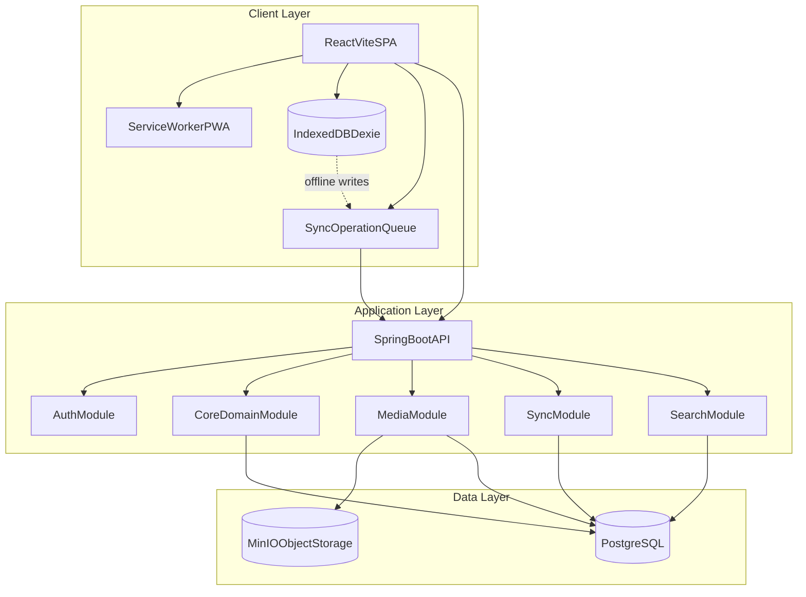
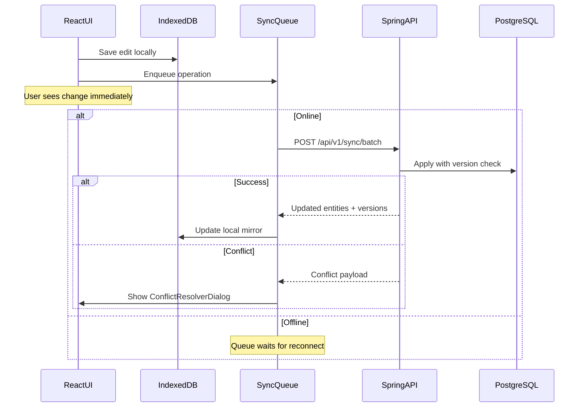

# Target Architecture v1 — Museum App

> **Stack:** React + Vite + Spring Boot + PostgreSQL + MinIO + IndexedDB  
> **Status:** Foundation (Stage A) complete; Stages B–F planned  
> **Data model:** [ERD v2](./ERD_museum_v2.md) (extended museum model with full cardinalities)  
> **Last updated:** 2026-05-29

---

## 1. Architectural principles


| Principle                         | Implementation                                                              |
| --------------------------------- | --------------------------------------------------------------------------- |
| **PostgreSQL is source of truth** | All business entities, relations, audit records                             |
| **Object storage for media**      | TIFF, JPEG, PDF, video — never in SQL blobs                                 |
| **Local-first offline**           | IndexedDB + sync queue on client; server resolves conflicts                 |
| **API-first**                     | REST endpoints; OpenAPI spec generated from Spring                          |
| **Modular monolith**              | Single deployable backend with clear domain packages; split later if needed |
| **Audit everything critical**     | Object changes, condition reports, location moves, exhibition assignments   |


### High-level diagram




---

## 2. Repository structure

```
Museum-App/
├── frontend/                    # React + Vite + TypeScript
│   ├── src/
│   │   ├── app/                 # App shell, routing, providers
│   │   ├── features/            # Feature modules (see §4)
│   │   ├── shared/              # UI kit, hooks, utils, types
│   │   ├── api/                 # HTTP client, API types
│   │   └── offline/             # IndexedDB, sync queue, conflict UI
│   └── public/
├── backend/                     # Spring Boot 3 + Java 21
│   └── src/main/java/com/museum/app/
│       ├── auth/                # JWT, users, roles
│       ├── config/              # Security, CORS, MinIO, Jackson
│       ├── core/                # Museum objects, persons, materials, categories
│       ├── provenance/          # Provenance, insurance history
│       ├── restoration/         # Restoration + Restaurierungsdokumentation
│       ├── research/            # ResearchReport (Forschungsdokumentation)
│       ├── arthistory/          # ArtHistoricalReport (Kunsthistorische Information)
│       ├── document/            # ObjectDocument (PDF/file attachments)
│       ├── loan/                # Loan traffic (incoming/outgoing)
│       ├── condition/           # Condition reports, damages
│       ├── exhibition/          # Exhibitions, exhibition-object links
│       ├── storage/             # Storage locations, containers, climate data
│       ├── identifier/          # Barcode, RFID, NFC identifiers
│       ├── media/               # Upload, presigned URLs, metadata
│       ├── sync/                # Batch sync, conflict resolution
│       ├── search/              # PostgreSQL full-text (Stage D)
│       ├── audit/               # Audit log, object events
│       └── common/              # Base entities, exceptions, DTOs
├── docs/
│   ├── TARGET_ARCHITECTURE_V1.md   # this file
│   └── ERD_museum_v2.md            # entity-relationship model + field dictionary
├── docker/
│   ├── docker-compose.yml       # PostgreSQL + MinIO + backend
│   └── init/                    # DB init scripts
├── .github/workflows/ci.yml
└── README.md
```

---

## 3. Backend modules

### 3.1 Package map


| Module          | Package                      | Responsibility                                                              |
| --------------- | ---------------------------- | --------------------------------------------------------------------------- |
| **Auth**        | `com.museum.app.auth`        | Login, JWT, `UserAccount`, `Role`, RBAC                                     |
| **Config**      | `com.museum.app.config`      | Security filter chain, CORS, MinIO client, Flyway                           |
| **Common**      | `com.museum.app.common`      | `BaseEntity`, shared DTOs, mappers, exceptions                              |
| **Core**        | `com.museum.app.core`        | `MuseumObject`, `Person`, `Organization`, `Category`, `Material`, M:N joins |
| **Provenance**  | `com.museum.app.provenance`  | `Provenance`, `Insurance` (1:n history per object)                          |
| **Restoration** | `com.museum.app.restoration` | `Restoration` + Restaurierungsdokumentation                                 |
| **Research**    | `com.museum.app.research`    | `ResearchReport` (Forschungsdokumentation)                                  |
| **ArtHistory**  | `com.museum.app.arthistory`  | `ArtHistoricalReport` (Kunsthistorische Information, Versionierung)         |
| **Document**    | `com.museum.app.document`    | `ObjectDocument` — polymorphic PDF/file attachments                         |
| **Loan**        | `com.museum.app.loan`        | `Loan` (incoming/outgoing, separate from transport)                         |
| **Condition**   | `com.museum.app.condition`   | `ConditionReport` (history), `DamageType`, `DamageEntry`                    |
| **Exhibition**  | `com.museum.app.exhibition`  | `Exhibition`, `ExhibitionObject`, `ExhibitionTransport`                     |
| **Storage**     | `com.museum.app.storage`     | `StorageLocation`, `Container`, `ClimateData`                               |
| **Identifier**  | `com.museum.app.identifier`  | `Identifier` (barcode, RFID, NFC, QR)                                       |
| **Media**       | `com.museum.app.media`       | `ObjectPhoto`, MinIO upload, presigned URLs                                 |
| **Audit**       | `com.museum.app.audit`       | `AuditLog`, `ObjectEvent`                                                   |
| **Sync**        | `com.museum.app.sync`        | Batch sync, version checks, conflict resolution                             |
| **Search**      | `com.museum.app.search`      | PostgreSQL full-text + JSONB search                                         |


### 3.2 Base entity (all business tables)

Every syncable entity extends:

```java
// common/BaseEntity.java (conceptual)
UUID id;
Instant createdAt;
Instant updatedAt;
Long version;           // optimistic locking + sync
Boolean isDeleted;      // soft delete
UUID createdBy;
UUID updatedBy;
```

### 3.3 Services list (backend)


| Service                  | Module      | Key methods                                       |
| ------------------------ | ----------- | ------------------------------------------------- |
| `AuthService`            | auth        | `login()`, `validateToken()`, `getCurrentUser()`  |
| `UserService`            | auth        | CRUD users, role assignment                       |
| `RoleService`            | auth        | List roles, seed defaults                         |
| `MuseumObjectService`    | core        | CRUD, filters, assign category/material/person    |
| `PersonService`          | core        | CRUD persons, link to objects via `object_person` |
| `OrganizationService`    | core        | CRUD institutions                                 |
| `CategoryService`        | core        | Managed vocabulary CRUD                           |
| `MaterialService`        | core        | Material + submaterial catalog                    |
| `ProvenanceService`      | provenance  | CRUD provenance entries per object                |
| `InsuranceService`       | provenance  | CRUD insurance history (1:n)                      |
| `RestorationService`     | restoration | CRUD restoration + documentation links            |
| `ResearchReportService`  | research    | CRUD Forschungsdokumentation                      |
| `ArtHistoricalService`   | arthistory  | CRUD kunsthistorische Sachexpertise, versions     |
| `ObjectDocumentService`  | document    | Upload/link PDFs to any report entity             |
| `LoanService`            | loan        | CRUD loans, condition before/after linking        |
| `ConditionReportService` | condition   | Create report history, attach damages             |
| `DamageCatalogService`   | condition   | Damage type vocabulary                            |
| `ExhibitionService`      | exhibition  | CRUD exhibition, link/unlink objects              |
| `StorageLocationService` | storage     | Location CRUD, assign object                      |
| `ContainerService`       | storage     | Container CRUD, assign objects                    |
| `ClimateDataService`     | storage     | Log temp/RH/lux/pollutants per storage            |
| `IdentifierService`      | identifier  | CRUD barcode/RFID/NFC per object                  |
| `MediaAssetService`      | media       | Upload, link to entity, thumbnail job             |
| `MinioStorageService`    | media       | Put/get object, presigned URL, checksum           |
| `AuditService`           | audit       | Record change, query history                      |
| `ObjectEventService`     | audit       | Domain events: moved, exhibited, restored, loaned |
| `SyncService`            | sync        | `applyBatch(operations)`, conflict detection      |
| `SearchService`          | search      | Full-text + facet query over objects              |


### 3.4 REST API surface (v1)


| Method   | Path                                          | Module      | Auth             |
| -------- | --------------------------------------------- | ----------- | ---------------- |
| POST     | `/api/auth/login`                             | auth        | public           |
| GET      | `/api/public/health`                          | config      | public           |
| GET/POST | `/api/v1/users`                               | auth        | ADMIN            |
| GET/POST | `/api/v1/objects`                             | core        | CURATOR+         |
| GET      | `/api/v1/objects/{id}`                        | core        | VIEWER+          |
| PUT      | `/api/v1/objects/{id}`                        | core        | CURATOR+         |
| DELETE   | `/api/v1/objects/{id}`                        | core        | ADMIN            |
| GET/POST | `/api/v1/objects/{id}/provenance`             | provenance  | CURATOR+         |
| GET/POST | `/api/v1/objects/{id}/insurance`              | provenance  | CURATOR+         |
| GET/POST | `/api/v1/objects/{id}/restorations`           | restoration | CONSERVATOR+     |
| GET/POST | `/api/v1/objects/{id}/research-reports`       | research    | RESEARCHER+      |
| GET/POST | `/api/v1/objects/{id}/art-historical-reports` | arthistory  | CURATOR+         |
| GET/POST | `/api/v1/objects/{id}/documents`              | document    | CURATOR+         |
| POST     | `/api/v1/objects/{id}/documents/upload`       | document    | CURATOR+         |
| GET/POST | `/api/v1/objects/{id}/loans`                  | loan        | CURATOR+         |
| GET/POST | `/api/v1/objects/{id}/condition-reports`      | condition   | CONSERVATOR+     |
| GET/POST | `/api/v1/objects/{id}/identifiers`            | identifier  | CURATOR+         |
| GET/POST | `/api/v1/objects/{id}/photos`                 | media       | CURATOR+         |
| GET/POST | `/api/v1/persons`                             | core        | CURATOR+         |
| GET/POST | `/api/v1/materials`                           | core        | CURATOR+         |
| GET/POST | `/api/v1/categories`                          | core        | CURATOR+         |
| GET/POST | `/api/v1/exhibitions`                         | exhibition  | CURATOR+         |
| POST     | `/api/v1/exhibitions/{id}/objects`            | exhibition  | CURATOR+         |
| GET/POST | `/api/v1/storage-locations`                   | storage     | STORAGE_MANAGER+ |
| GET/POST | `/api/v1/storage-locations/{id}/climate-data` | storage     | STORAGE_MANAGER+ |
| GET/POST | `/api/v1/containers`                          | storage     | STORAGE_MANAGER+ |
| POST     | `/api/v1/media/upload`                        | media       | CURATOR+         |
| GET      | `/api/v1/media/{id}/url`                      | media       | VIEWER+          |
| POST     | `/api/v1/sync/batch`                          | sync        | authenticated    |
| GET      | `/api/v1/sync/changes?since={ts}`             | sync        | authenticated    |
| GET      | `/api/v1/search?q={query}`                    | search      | VIEWER+          |
| GET      | `/api/v1/audit/objects/{id}`                  | audit       | CURATOR+         |


### 3.5 RBAC roles


| Role              | Permissions                                                    |
| ----------------- | -------------------------------------------------------------- |
| `ADMIN`           | Full access, user/role management, delete objects              |
| `CURATOR`         | CRUD objects, provenance, insurance, exhibitions, loans, media |
| `CONSERVATOR`     | Condition reports, restoration, damages; read objects          |
| `STORAGE_MANAGER` | Storage locations, containers, climate data; read objects      |
| `GUEST`           | Read-only: objects, search, media view                         |
| `VIEWER`          | Alias/legacy read-only (maps to `GUEST` in v2)                 |


---

## 4. Frontend modules

### 4.1 Feature map

```
frontend/src/
├── app/
│   ├── App.tsx
│   ├── router.tsx              # React Router routes
│   └── providers/
│       ├── AuthProvider.tsx
│       ├── SyncProvider.tsx
│       └── OfflineProvider.tsx
├── features/
│   ├── auth/
│   │   ├── LoginPage.tsx
│   │   └── useAuth.ts
│   ├── objects/
│   │   ├── ObjectListPage.tsx
│   │   ├── ObjectDetailPage.tsx      # tabs: core, history, media, identifiers
│   │   ├── ObjectForm.tsx
│   │   └── useObjects.ts
│   ├── provenance/
│   │   ├── ProvenanceList.tsx
│   │   ├── InsuranceList.tsx
│   │   └── useProvenance.ts
│   ├── restoration/
│   │   ├── RestorationList.tsx
│   │   └── useRestorations.ts
│   ├── loan/
│   │   ├── LoanList.tsx
│   │   └── useLoans.ts
│   ├── persons/
│   │   ├── PersonListPage.tsx
│   │   └── PersonForm.tsx
│   ├── condition/
│   │   ├── ConditionReportForm.tsx
│   │   ├── ConditionHistoryTimeline.tsx
│   │   ├── DamageEntryList.tsx
│   │   └── useConditionReports.ts
│   ├── exhibitions/
│   │   ├── ExhibitionListPage.tsx
│   │   └── ExhibitionDetailPage.tsx
│   ├── storage/
│   │   ├── StorageLocationPage.tsx
│   │   ├── ContainerPage.tsx
│   │   └── ClimateDataChart.tsx
│   ├── identifiers/
│   │   ├── IdentifierList.tsx
│   │   └── BarcodeScanner.tsx        # optional, Stage F
│   ├── media/
│   │   ├── MediaUploader.tsx
│   │   ├── PhotoGallery.tsx
│   │   └── useMediaAssets.ts
│   ├── search/
│   │   ├── SearchPage.tsx
│   │   └── SearchFilters.tsx
│   └── sync/
│       ├── SyncStatusBar.tsx
│       └── ConflictResolverDialog.tsx
├── offline/
│   ├── db.ts                   # Dexie schema
│   ├── syncQueue.ts            # Operation queue manager
│   ├── syncWorker.ts           # Background sync on reconnect
│   └── conflictResolver.ts
├── api/
│   ├── client.ts               # fetch wrapper + JWT header
│   ├── types.ts                # Shared TS types (mirror backend DTOs)
│   └── endpoints.ts
└── shared/
    ├── components/             # Button, Input, Table, Modal, Badge
    ├── hooks/                  # useOnlineStatus, useDebounce
    └── utils/
```

### 4.2 Frontend services / hooks


| Hook / Service        | Location             | Responsibility                      |
| --------------------- | -------------------- | ----------------------------------- |
| `useAuth`             | features/auth        | Login, token storage, logout        |
| `useOnlineStatus`     | shared/hooks         | Detect online/offline               |
| `useObjects`          | features/objects     | CRUD with offline fallback          |
| `useProvenance`       | features/provenance  | Provenance + insurance history      |
| `useRestorations`     | features/restoration | Restoration records per object      |
| `useLoans`            | features/loan        | Loan traffic per object             |
| `useConditionReports` | features/condition   | Condition report history (timeline) |
| `useMediaAssets`      | features/media       | Upload with local blob cache        |
| `useSync`             | features/sync        | Trigger sync, show status           |
| `syncQueue`           | offline/syncQueue    | Enqueue local operations            |
| `syncWorker`          | offline/syncWorker   | Flush queue when online             |
| `db` (Dexie)          | offline/db           | Local mirror of server entities     |


### 4.3 IndexedDB schema (Dexie)

```typescript
// offline/db.ts (conceptual)
class MuseumDB extends Dexie {
  objects!: Table<MuseumObject>;
  persons!: Table<Person>;
  provenance!: Table<Provenance>;
  insurance!: Table<Insurance>;
  restorations!: Table<Restoration>;
  loans!: Table<Loan>;
  conditionReports!: Table<ConditionReport>;
  identifiers!: Table<Identifier>;
  materials!: Table<Material>;
  categories!: Table<Category>;
  exhibitions!: Table<Exhibition>;
  storageLocations!: Table<StorageLocation>;
  climateData!: Table<ClimateData>;
  mediaAssets!: Table<MediaAsset>;
  syncOperations!: Table<SyncOperation>;
  syncMeta!: Table<{ key: string; lastSyncedAt: string }>;
}
```

### 4.4 Offline sync flow




---

## 5. Infrastructure services

### 5.1 Docker Compose (local dev)


| Service    | Image                  | Port       | Purpose                        |
| ---------- | ---------------------- | ---------- | ------------------------------ |
| `postgres` | postgres:16            | 5432       | Relational core                |
| `minio`    | minio/minio            | 9000, 9001 | Object storage (S3-compatible) |
| `backend`  | built from `backend/`  | 8080       | Spring Boot API                |
| `frontend` | built from `frontend/` | 5173       | Vite dev server (dev only)     |


### 5.2 Environment variables


| Variable                     | Service  | Example                                  |
| ---------------------------- | -------- | ---------------------------------------- |
| `SPRING_DATASOURCE_URL`      | backend  | `jdbc:postgresql://postgres:5432/museum` |
| `SPRING_DATASOURCE_USERNAME` | backend  | `museum`                                 |
| `SPRING_DATASOURCE_PASSWORD` | backend  | `museum_dev`                             |
| `APP_JWT_SECRET`             | backend  | 32+ byte secret                          |
| `APP_MINIO_ENDPOINT`         | backend  | `http://minio:9000`                      |
| `APP_MINIO_ACCESS_KEY`       | backend  | `minioadmin`                             |
| `APP_MINIO_SECRET_KEY`       | backend  | `minioadmin`                             |
| `APP_MINIO_BUCKET`           | backend  | `museum-media`                           |
| `VITE_API_BASE_URL`          | frontend | `/api` (proxied in dev)                  |


---

## 6. Data model summary ([ERD v2](./ERD_museum_v2.md))

Full field dictionary, cardinalities, indexes, and Flyway plan: **[ERD_museum_v2.md](./ERD_museum_v2.md)**

### Entity groups


| Group                        | Tables                                                                                                           | Key cardinality                 |
| ---------------------------- | ---------------------------------------------------------------------------------------------------------------- | ------------------------------- |
| **Core**                     | `museum_object`, `person`, `organization`, `object_person`                                                       | Object n:m Person               |
| **Catalogs**                 | `category`, `material`, `submaterial`, `damage_type`, `packaging_type`, `transport_type`                         | Lookups + M:N joins             |
| **History (1:n per object)** | `provenance`, `insurance`, `restoration`, `loan`, `condition_report`, `research_report`, `art_historical_report` | Object 1:n each                 |
| **Documents**                | `object_document` (polymorphic PDF/files linked to reports)                                                      | Report 1:n                      |
| **Damages**                  | `damage_entry`                                                                                                   | ConditionReport 1:n DamageEntry |
| **Exhibitions**              | `exhibition`, `exhibition_object`, `exhibition_transport`                                                        | Object n:m Exhibition           |
| **Storage**                  | `storage_location`, `container`, `climate_data`                                                                  | Storage 1:n ClimateData         |
| **Media & IDs**              | `object_photo`, `identifier`                                                                                     | Object 1:n each                 |
| **Auth**                     | `role`, `user_account`                                                                                           | Role 1:n User                   |
| **Audit**                    | `audit_log`, `object_event`                                                                                      | Object 1:n ObjectEvent          |


### Removed flat fields (migrated to relations)


| Old (flat on Object)       | New (relation)                                 |
| -------------------------- | ---------------------------------------------- |
| `author` (string)          | `object_person` → `person` (role=author)       |
| `condition` (string)       | `condition_report` (history, latest = current) |
| `photo` (link)             | `object_photo`                                 |
| `standort` (string)        | `storage_location_id`                          |
| `barcode` / `rfid`         | `identifier`                                   |
| `insurance` (single field) | `insurance` (1:n history)                      |
| `editor`                   | `user_account` / `created_by`                  |


### Flexible metadata (JSONB on `museum_object.metadata`)

```json
{
  "iiif": { "manifest_uri": "..." },
  "ocr": { "text": "...", "confidence": 0.94 },
  "external_import": { "source": "lido", "raw_id": "..." },
  "research_notes": ["..."],
  "custom_fields": {}
}
```

---

## 7. Roadmap — Stages B through F

### Stage B — Relational Core

**Goal:** PostgreSQL schema (ERD v2), migrations, CRUD API for core entities.


| Task                                                    | Backend | Frontend |
| ------------------------------------------------------- | ------- | -------- |
| Flyway V1–V7 migrations (see ERD v2 §9)                 | ✓       | —        |
| JPA entities + repositories for core group              | ✓       | —        |
| `MuseumObjectService`, `PersonService` + REST           | ✓       | —        |
| Material/Category catalog endpoints                     | ✓       | —        |
| `Role` + `UserAccount` tables (replace in-memory admin) | ✓       | —        |
| Docker Compose: PostgreSQL                              | ✓       | —        |
| Object list + detail pages (tabs skeleton)              | —       | ✓        |
| Object create/edit form                                 | —       | ✓        |
| API client + typed DTOs                                 | —       | ✓        |


**Deliverables:**

- Flyway migrations per [ERD v2 §9](./ERD_museum_v2.md#9-flyway-migrationsplan)
  - ✅ `V1__lookup_tables.sql` — lookup tables + seed data
  - ✅ `V2__core_entities.sql` — core entities + object identification strategy
  - ✅ `V3__history_entities.sql` — history + restoration/research/art-historical documentation
- CRUD `/api/v1/objects`, `/api/v1/persons`, `/api/v1/materials`, `/api/v1/categories`
- DB-backed users with roles (ADMIN, CURATOR, CONSERVATOR, STORAGE_MANAGER, GUEST)
- Frontend object management UI
- CI runs against PostgreSQL (Testcontainers)

**Estimated scope:** 3–4 weeks

---

### Stage C — Media + Audit

**Goal:** Photo upload to MinIO, audit log, object event history.


| Task                                                | Backend | Frontend |
| --------------------------------------------------- | ------- | -------- |
| MinIO integration + `MediaAssetService`             | ✓       | —        |
| Upload endpoint (multipart + presigned)             | ✓       | —        |
| Thumbnail generation (async job)                    | ✓       | —        |
| `AuditService` + `ObjectEventService`               | ✓       | —        |
| Audit REST endpoints                                | ✓       | —        |
| Docker Compose: MinIO                               | ✓       | —        |
| `MediaUploader` component                           | —       | ✓        |
| `PhotoGallery` with role labels (front/back/detail) | —       | ✓        |
| Audit history panel on object detail                | —       | ✓        |


**Deliverables:**

- Upload/view photos linked to objects
- MinIO bucket auto-created on startup
- Audit log records all object mutations
- Object events: created, updated, condition_report_added, photo_uploaded

**Estimated scope:** 2 weeks

---

### Stage D — History Entities + Condition + Search-lite

**Goal:** Provenance, insurance, restoration, loan, condition reports, exhibitions, search.


| Task                                                               | Backend | Frontend |
| ------------------------------------------------------------------ | ------- | -------- |
| `ProvenanceService`, `InsuranceService`                            | ✓       | —        |
| `RestorationService`, `LoanService`                                | ✓       | —        |
| `ConditionReportService` + damages                                 | ✓       | —        |
| `ExhibitionService` + linking                                      | ✓       | —        |
| `StorageLocationService`, `ContainerService`, `ClimateDataService` | ✓       | —        |
| `IdentifierService`                                                | ✓       | —        |
| JSONB metadata column + validation                                 | ✓       | —        |
| PostgreSQL full-text index + `SearchService`                       | ✓       | —        |
| Provenance/insurance/restoration/loan UI tabs                      | —       | ✓        |
| Condition report form + history timeline                           | —       | ✓        |
| Exhibition management UI                                           | —       | ✓        |
| Storage + climate data UI                                          | —       | ✓        |
| Identifier management (barcode/RFID)                               | —       | ✓        |
| Search page with filters                                           | —       | ✓        |


**Deliverables:**

- Full history entities per [ERD v2](./ERD_museum_v2.md)
- Condition report workflow with damage catalog
- Exhibition ↔ object linking (n:m)
- Climate data logging with sensor support
- Search by title, inventar, person, material, condition

**Estimated scope:** 4 weeks

---

### Stage E — Offline Sync

**Goal:** Full offline create/edit with sync queue and conflict resolution.


| Task                                                | Backend | Frontend |
| --------------------------------------------------- | ------- | -------- |
| `SyncService`: batch apply + version check          | ✓       | —        |
| `GET /api/v1/sync/changes?since=` delta endpoint    | ✓       | —        |
| Conflict response format (server vs client version) | ✓       | —        |
| Dexie schema + local entity mirror                  | —       | ✓        |
| `syncQueue` + `syncWorker`                          | —       | ✓        |
| Optimistic UI (write locally first)                 | —       | ✓        |
| `ConflictResolverDialog`                            | —       | ✓        |
| PWA Service Worker (app shell cache)                | —       | ✓        |
| `SyncStatusBar` (online/offline/pending count)      | —       | ✓        |
| Background sync on `online` event                   | —       | ✓        |


**Deliverables:**

- Create/edit objects offline; sync when online
- Condition reports work offline
- Conflict UI for version mismatches
- PWA installable on tablet (museum floor use)
- No data loss on network interruption

**Estimated scope:** 3–4 weeks

---

### Stage F — Advanced Discovery + Hardening

**Goal:** Production readiness, advanced search, async processing pipeline.


| Task                                            | Backend | Frontend |
| ----------------------------------------------- | ------- | -------- |
| OpenSearch/Elasticsearch integration (optional) | ✓       | —        |
| Async OCR pipeline (Tesseract / cloud API)      | ✓       | —        |
| Thumbnail + derivative generation worker        | ✓       | —        |
| IIIF manifest generation                        | ✓       | —        |
| Rate limiting + request logging                 | ✓       | —        |
| Backup scripts (pg_dump + MinIO mirror)         | ✓       | —        |
| Health checks + metrics (Actuator)              | ✓       | —        |
| Advanced search UI (facets, autocomplete)       | —       | ✓        |
| IIIF image viewer (optional)                    | —       | ✓        |
| Export (CSV/PDF object reports)                 | —       | ✓        |
| E2E tests (Playwright)                          | —       | ✓        |


**Deliverables:**

- Production Docker Compose / deployment guide
- Monitoring dashboard (Spring Actuator + optional Grafana)
- Automated backups
- E2E test suite covering critical flows
- Optional: Elasticsearch for OCR + faceted discovery

**Estimated scope:** 3–4 weeks

---

## 8. Technology decisions — rationale


| Choice                | Why                                                                   | Alternative considered                               |
| --------------------- | --------------------------------------------------------------------- | ---------------------------------------------------- |
| **Spring Boot**       | Transactional integrity, mature security, long-lived enterprise fit   | Django, FastAPI, NestJS                              |
| **PostgreSQL**        | ACID + JSONB + full-text + PostGIS future                             | MongoDB (rejected: loses relational integrity)       |
| **MinIO**             | S3-compatible, self-hosted, cheap dev/prod parity                     | Local filesystem (rejected: no scalability)          |
| **IndexedDB (Dexie)** | Structured offline storage in browser, no native app needed           | SQLite via Tauri (deferred: adds complexity)         |
| **React + Vite**      | Fast dev, PWA-ready, no SSR needed for admin UI                       | Next.js (deferred: SSR not needed for internal tool) |
| **Flyway**            | Versioned SQL migrations, CI-friendly                                 | Liquibase (equivalent; either works)                 |
| **JWT**               | Stateless auth, works with offline queue replay                       | Session cookies (rejected: harder with offline)      |
| **Modular monolith**  | Simpler deploy for small team; split to microservices later if needed | Microservices from day 1 (rejected: premature)       |


---

## 9. What is explicitly deferred (post-v1)


| Feature                             | Reason to defer                                           |
| ----------------------------------- | --------------------------------------------------------- |
| Elasticsearch / OpenSearch          | PostgreSQL full-text sufficient until OCR + large catalog |
| GraphQL API                         | REST covers all v1 clients                                |
| CIDOC CRM / Linked Open Data        | Research/public portal feature                            |
| AI tagging / semantic search        | Requires ML pipeline + training data                      |
| Multi-tenant (multiple museums)     | Single-institution scope for v1                           |
| Native mobile app                   | PWA covers tablet use case                                |
| Real-time collaboration (WebSocket) | Audit log sufficient for v1                               |


---

## 10. Cross-cutting concerns

### 10.1 Error handling

- Backend: `@ControllerAdvice` global handler → consistent JSON error body `{ code, message, details }`
- Frontend: API client intercepts 401 → redirect to login; 409 → conflict resolver

### 10.2 Validation

- Backend: Jakarta Bean Validation on DTOs
- Frontend: Zod schemas mirroring backend constraints

### 10.3 Testing strategy


| Layer               | Tool                               | Coverage target                             |
| ------------------- | ---------------------------------- | ------------------------------------------- |
| Backend unit        | JUnit 5 + Mockito                  | Services, mappers                           |
| Backend integration | Testcontainers (PostgreSQL, MinIO) | Repositories, controllers                   |
| Frontend unit       | Vitest + Testing Library           | Hooks, utils                                |
| E2E                 | Playwright                         | Login, object CRUD, offline sync (Stage E+) |


### 10.4 CI pipeline (current + planned)

```yaml
# Current (Stage A)
frontend: npm ci → lint → build
backend:  mvn test

# Planned additions
backend:  mvn test (with Testcontainers PostgreSQL)
frontend: vitest run
e2e:      playwright test (Stage F)
docker:   docker compose build (Stage C+)
```

---

## 11. Quick reference — stage checklist


| Stage | Focus            | Key output                                                | Status     |
| ----- | ---------------- | --------------------------------------------------------- | ---------- |
| **A** | Foundation       | React + Spring skeleton, JWT auth, CI                     | ✅ Done     |
| **B** | Relational Core  | PostgreSQL ERD v2, object/person CRUD, DB users           | 🔲 Next    |
| **C** | Media + Audit    | MinIO upload, audit log, object events                    | 🔲 Planned |
| **D** | History + Search | Provenance, insurance, restoration, loan, climate, search | 🔲 Planned |
| **E** | Offline Sync     | IndexedDB, sync queue, PWA                                | 🔲 Planned |
| **F** | Hardening        | E2E tests, monitoring, advanced search                    | 🔲 Planned |


---

## 12. Related documents


| Document                  | Location                                      | Status     |
| ------------------------- | --------------------------------------------- | ---------- |
| Project README            | `[README.md](../README.md)`                   | ✅          |
| ERD v2 + field dictionary | `[docs/ERD_museum_v2.md](./ERD_museum_v2.md)` | ✅          |
| API spec (OpenAPI)        | `docs/openapi.yaml`                           | 🔲 Stage B |
| Docker Compose            | `docker/docker-compose.yml`                   | 🔲 Stage B |
| Database migrations       | `backend/src/main/resources/db/migration/`    | 🔲 Stage B |


